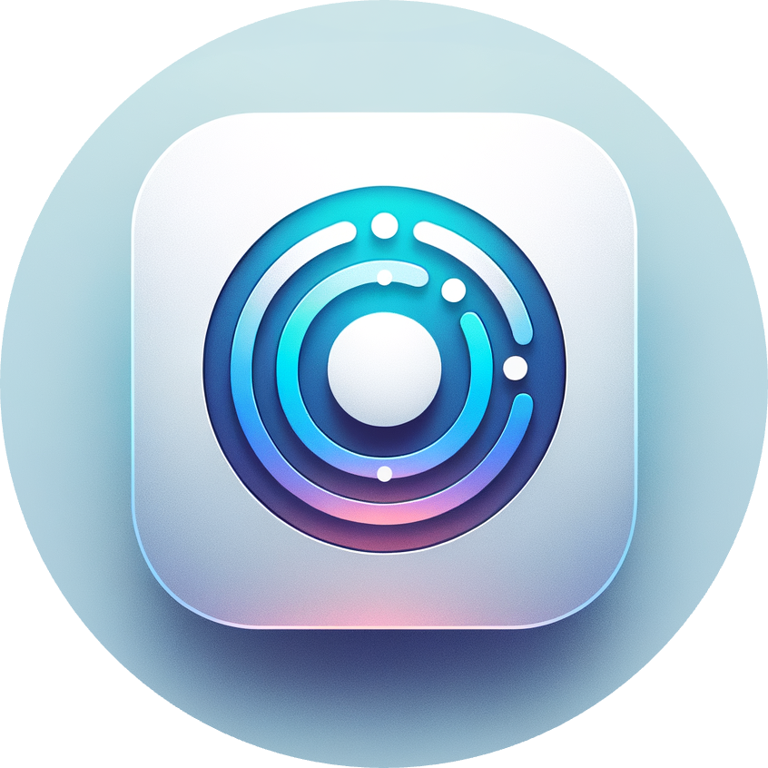

<div align="center">
  
</div>
<div align="center">
  <h1>Seantra-Chat 在线多人聊天应用</h1>
    
    
</div>
<div align="center">
    
    
    
    
    
    
    
</div>
<div align="center">
    
    
    
    
    
    
</div>

- - -

本项目使用 concurrently 并行启动多个服务，分别是：

- Next.js 前端服务器
- Express 后端服务器

### 开发

在 /server 目录下新建 `.env.local`, 新增如下配置

```dotenv
DATABASE_URL = [MongoDB 连接地址] (例如 mongodb://localhost:27017/next-starter)
SECRET_KEY = [该应用程序的秘钥]
```

秘钥可通过以下 Node 代码生成：
```js
const crypto = require('crypto');
const secretKey = crypto.randomBytes(32).toString('hex');
process.env.SECRET_KEY = secretKey;
```

```bash
nvm use

// 安装依赖
pnpm install
// 如果在根目录安装报错，执行以下命令
cd client && pnpm install
cd server && pnpm install

// 启动开发
pnpm dev
```

### 构建

```bash
nvm use
pnpm build
```

### 启动

```bash
nvm use
pnpm start
```
